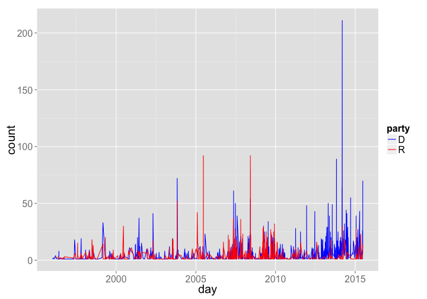

rsunlight
======


Linux: [](https://travis-ci.org/rOpenGov/rsunlight)
Windows: [](https://ci.appveyor.com/api/projects/status/ytc2qdo3u2t3ltm6/branch/master)

+ Maintainer: [Scott Chamberlain](https://github.com/sckott/)
+ License: [MIT](http://opensource.org/licenses/MIT)
+ Report any problems in the [Issues Tracker](https://github.com/ropengov/rsunlight/issues), or just fork and submit changes, etc.

## Description

`rsunlight` is a collection of functions to search and acquire data from the various Sunlight Labs APIs for government data, at [http://sunlightfoundation.com/api/](http://sunlightfoundation.com/api/).

`rsunlight` wraps functions in APIs for:

* Congress API (`cg`)
* Open States API (`os`)
* Capitol Words API (`cw`)
* Influence Explorer API (`ie`)

Functions that wrap these sets of APIs will be prefixed by `cg`, `os`, `cw`, or `ie` for the different methods listed above:

* `cg` + `fxn`
* `os` + `fxn`
* `cw` + `fxn`
* `ie` + `fxn`

where `fxn` would be a function to a interface with a specific Sunlight Foundation API.

Please get your own API keys if you plant to use these functions for Sunlight Labs (http://sunlightfoundation.com/api/).

Data from the Sunlight Foundation API is provided by Sunlight Foundation.

<a href="http://sunlightfoundation.com/api/"></a>

We set up the functions so that you can put the key in your .Rprofile file, which will be called on startup of R, and then you don't have to enter your API key for each run of a function. For example, put this in your `.Rprofile` file:

```
# key for API access to the Sunlight Labs API methods
options(SunlightLabsKey = "YOURKEYHERE")
```

**Note** that Puerto Rico is not included in Sunlight Foundation data.

If you store your key in your `.Rprofile` file it will be read inside of each function call. Or you can pass your key into each function call manually by `key=yourkey`.

## Install rsunlight

From CRAN


```r
install.packages("rsunlight")
```

Or development version from Github


```r
install.packages("devtools")
library(devtools)
install_github("ropengov/rsunlight")
```

## Load rsunlight


```r
library("rsunlight")
```

## Get districts for a latitude/longitude.


```r
cg_districts(latitude = 35.778788, longitude = -78.787805)
#> $results
#>   state district
#> 1    NC        2
#> 
#> $count
#> [1] 1
```

## Search congress people and senate members.


```r
out <- cg_legislators(last_name = 'Reed')
```

## Find the popularity of a phrase over a period of time.

Get a list of how many times the phrase "united states" appears in the Congressional Record in each month between January and June, 2010:


```r
cw_timeseries(phrase='united states', start_date='2009-01-01', end_date='2009-04-30', granularity='month')
#>   count      month
#> 1  3805 2009-01-01
#> 2  3512 2009-02-01
#> 3  6018 2009-03-01
#> 4  2967 2009-04-01
```


```r
library("ggplot2")
dat_d <- cw_timeseries(phrase='climate change', party="D")
dat_d$party <- rep("D", nrow(dat_d))
dat_r <- cw_timeseries(phrase='climate change', party="R")
dat_r$party <- rep("R", nrow(dat_r))
dat_both <- rbind(dat_d, dat_r)
ggplot(dat_both, aes(day, count, colour=party)) +
  geom_line() +
  theme_grey(base_size=20) +
  scale_colour_manual(values=c("blue","red"))
```

 

## Interactive charts using rCharts

Note that the resulting chart opens in a browser, so is not shown in this vignette, but you will see it open in a browser when you run the code.


```r
dream <- lapply(c('D','R'), function(x) cw_timeseries(phrase='i have a dream', party=x, start_date='1996-01-01', end_date='2013-01-01', granularity='month'))
df <- merge(dream[[1]], dream[[2]], by='month', all=TRUE)
df[is.na(df)] <- 0
names(df) <- c('date','D','R')
df$date <- as.character(df$date)
```


```r
library(rCharts)
m1 <- mPlot(x = "date", y = c("D", "R"), type = "Line", data = df)
m1$set(pointSize = 0, lineWidth = 1)
m1
```

_note: as you can see this is not actually interactive, but when you make it, it will be_


## Return the top contributing organizations

Ranked by total dollars given. An organization's giving is broken down into money given directly (by the organization's PAC) versus money given by individuals employed by or associated with the organization.


```r
ie_industries(method='top_ind', limit=4)
#>      count        amount                               id
#> 1 14920003 3825328792.21 cdb3f500a3f74179bb4a5eb8b2932fa6
#> 2  3676565 2860383835.95 f50cf984a2e3477c8167d32e2b14e052
#> 3  1425026 1768144131.04 7500030dffe24844aa467a75f7aedfd1
#> 4   329908 1717719914.58 9cac88377c3b400e89c2d6762e3f28f6
#>   should_show_entity                   name
#> 1               TRUE                UNKNOWN
#> 2               TRUE      LAWYERS/LAW FIRMS
#> 3               TRUE            REAL ESTATE
#> 4               TRUE CANDIDATE SELF-FINANCE
```
